# Express - Node.js API with PostgreSQL


## ✨ Overview
This is a modern RESTful API built with **Node.js** and **Express**, designed to interact with a **PostgreSQL** database. The API provides various endpoints for managing user data, with additional features like authentication, JWT protection, soft deletion, and automated testing. We've also integrated **Swagger** for auto-generated API documentation.


## 🏗️ Architecture

```mermaid
flowchart TB
    %% Clients
    Clients["Clients (Web/Mobile/CLI)"]:::client

    %% Docker Container Boundary
    subgraph "Docker Container" 
        direction TB
        index["index.js\n(Express App Init)"]:::server
        click index "https://github.com/jawherkl/node-api-postgres/blob/main/index.js"

        %% Configuration Layer
        subgraph "Configuration Layer" 
            direction TB
            dbConfig["config/db.js"]:::config
            click dbConfig "https://github.com/jawherkl/node-api-postgres/blob/main/config/db.js"
            swaggerSetup["config/swagger.js"]:::config
            click swaggerSetup "https://github.com/jawherkl/node-api-postgres/blob/main/config/swagger.js"
            swaggerSpec["config/swagger.json"]:::config
            click swaggerSpec "https://github.com/jawherkl/node-api-postgres/blob/main/config/swagger.json"
        end

        %% Routing Layer
        subgraph "Routing Layer" 
            direction TB
            loginRoutes["routes/loginRoutes.js"]:::routes
            click loginRoutes "https://github.com/jawherkl/node-api-postgres/blob/main/routes/loginRoutes.js"
            userRoutes["routes/userRoutes.js"]:::routes
            click userRoutes "https://github.com/jawherkl/node-api-postgres/blob/main/routes/userRoutes.js"
            metricsRoutes["routes/metricsRoutes.js"]:::routes
            click metricsRoutes "https://github.com/jawherkl/node-api-postgres/blob/main/routes/metricsRoutes.js"
        end

        %% Controller Layer
        subgraph "Controller Layer"
            direction TB
            authController["controllers/authController.js"]:::controller
            click authController "https://github.com/jawherkl/node-api-postgres/blob/main/controllers/authController.js"
            userController["controllers/userController.js"]:::controller
            click userController "https://github.com/jawherkl/node-api-postgres/blob/main/controllers/userController.js"
            metricsController["controllers/metricsController.js"]:::controller
            click metricsController "https://github.com/jawherkl/node-api-postgres/blob/main/controllers/metricsController.js"
        end

        %% Middleware Pipeline
        subgraph "Middleware Pipeline"
            direction TB
            jwtAuth["middleware/auth.js"]:::middleware
            click jwtAuth "https://github.com/jawherkl/node-api-postgres/blob/main/middleware/auth.js"
            rbacAuth["middleware/authorize.js"]:::middleware
            click rbacAuth "https://github.com/jawherkl/node-api-postgres/blob/main/middleware/authorize.js"
            upload["middleware/upload.js"]:::middleware
            click upload "https://github.com/jawherkl/node-api-postgres/blob/main/middleware/upload.js"
            errorHandler["middleware/errorHandler.js"]:::middleware
            click errorHandler "https://github.com/jawherkl/node-api-postgres/blob/main/middleware/errorHandler.js"
        end

        %% Data Access Layer
        subgraph "Data Access Layer"
            direction TB
            userModel["models/user.js"]:::model
            click userModel "https://github.com/jawherkl/node-api-postgres/blob/main/models/user.js"
            metricsModel["models/metrics.js"]:::model
            click metricsModel "https://github.com/jawherkl/node-api-postgres/blob/main/models/metrics.js"
        end

        %% Utility Services
        subgraph "Utility Services"
            direction TB
            mailer["utils/mailer.js"]:::util
            click mailer "https://github.com/jawherkl/node-api-postgres/blob/main/utils/mailer.js"
            logger["utils/logger.js"]:::util
            click logger "https://github.com/jawherkl/node-api-postgres/blob/main/utils/logger.js"
        end

        %% Static Assets & Storage
        subgraph "Static & Storage"
            direction TB
            resetPage["public/reset-password.html"]:::static
            click resetPage "https://github.com/jawherkl/node-api-postgres/blob/main/public/reset-password.html"
            uploadsDir["uploads/"]:::infra
            click uploadsDir "https://github.com/jawherkl/node-api-postgres/tree/main/uploads/"
        end

        %% Exposed Swagger UI
        swaggerUI["Swagger UI\n(/api-docs)"]:::server
    end

    %% External Services & Infrastructure
    postgres[(PostgreSQL Database 5432)]:::external
    sendgrid[(SendGrid Email Service)]:::external
    prometheus[(Prometheus)]:::external
    dockerfile["Dockerfile"]:::infra
    click dockerfile "https://github.com/jawherkl/node-api-postgres/tree/main/Dockerfile"
    compose["docker-compose.yml"]:::infra
    click compose "https://github.com/jawherkl/node-api-postgres/blob/main/docker-compose.yml"
    promConfig["prometheus.yml"]:::infra
    click promConfig "https://github.com/jawherkl/node-api-postgres/blob/main/prometheus.yml"

    %% Connections
    Clients -->|"HTTP|JSON"| index
    index -->|"load"| dbConfig
    index -->|"load"| swaggerSetup
    swaggerSetup -->|"uses"| swaggerSpec
    index -->|"mount"| loginRoutes
    index -->|"mount"| userRoutes
    index -->|"mount"| metricsRoutes
    loginRoutes -->|"calls"| authController
    userRoutes -->|"calls"| userController
    metricsRoutes -->|"calls"| metricsController
    index -->|"use"| jwtAuth
    index -->|"use"| rbacAuth
    index -->|"use"| upload
    index -->|"use"| errorHandler
    authController -->|"DB ops"| userModel
    userController -->|"DB ops"| userModel
    metricsController -->|"DB ops"| metricsModel
    authController -->|"send email"| mailer
    metricsController -->|"log metrics"| logger
    metricsController -->|"expose /metrics"| prometheus
    index -->|"serve UI"| swaggerUI
    index -->|"serve file"| resetPage
    index -->|"write/read"| uploadsDir
    userModel -->|"SQL"| postgres
    metricsModel -->|"SQL"| postgres
    index -->|"HTTP"| postgres
    index -->|"SMTP/HTTP"| sendgrid
    prometheus -->|"scrape /metrics"| index

    %% Styles
    classDef client fill:#f9f,stroke:#333
    classDef server fill:#bbf,stroke:#333
    classDef config fill:#dfd,stroke:#333
    classDef routes fill:#ffd,stroke:#333
    classDef controller fill:#fdc,stroke:#333
    classDef middleware fill:#ffc,stroke:#333
    classDef model fill:#cdf,stroke:#333
    classDef util fill:#ddf,stroke:#333
    classDef static fill:#fcf,stroke:#333
    classDef external fill:#bfb,stroke:#333
    classDef infra fill:#fbf,stroke:#333
```



## 🚀 Features
- **User Management**:
  - **Get All Users**: Retrieve a list of all users.
  - **Get User by ID**: Retrieve a specific user by their ID.
  - **Create User**: Add a new user to the database.
  - **Update User**: Update details of an existing user.
  - **Delete User**: Remove a user from the database (soft delete functionality).
  
- **Authentication & Authorization**:
  - **User Authentication**: Secure API access using **JSON Web Tokens (JWT)**.
  - **Role-based Access Control (RBAC)**: Control access to resources based on user roles (e.g., admin, user).
  - **Password Reset**: Secure password reset functionality with time-limited tokens and email verification using **SendGrid**.

- **Swagger API Documentation**:
  - **Swagger** integrated for real-time API documentation and testing directly in the browser. Access the documentation at: [http://localhost:3000/api-docs](http://localhost:3000/api-docs).

- **Database**:
  - Integration with **PostgreSQL** for storing user data securely.
  - **Soft delete functionality**: Mark users as deleted without removing their data.

- **Unit Testing**:
  - Comprehensive unit tests using **Mocha** and **Chai** to ensure the reliability of the application.
  - **Test Cases**: Includes tests for user creation, update, deletion, and authentication.

## ⚙️ Technologies Used
- **Node.js** (JavaScript runtime)
- **Express** (Web framework)
- **PostgreSQL** (Database)
- **JSON Web Token (JWT)** (Authentication)
- **Body-Parser** (Parsing JSON request bodies)
- **Swagger** (API documentation)
- **Mocha** (Testing framework)
- **Chai** (Assertion library)

## 🛠️ Installation
### Step 1: Clone the Repository
```bash
git clone https://github.com/JawherKl/node-api-postgres.git
cd node-api-postgres
```

### Step 2: Install Dependencies
```bash
npm install
```

### Step 3: Set up PostgreSQL
Ensure you have **PostgreSQL** installed and running. Create a new database and configure the connection.

### Step 4: Configure Database Connection
Update the `db.js` file to set up your PostgreSQL connection credentials.

### Step 5: Generate JWT Secret (Optional)
Generate a random JWT secret key (recommended for production environments):
```bash
node -e "console.log(require('crypto').randomBytes(32).toString('hex'))"
```

### Inject Table into PostgreSQL
```sql
CREATE TABLE users (
  id SERIAL PRIMARY KEY,
  name VARCHAR(100) NOT NULL,
  email VARCHAR(255) UNIQUE NOT NULL,
  password VARCHAR(255) NOT NULL,
  picture VARCHAR(255) NULL,
  role VARCHAR(20) DEFAULT 'user',  -- Role-based access control
  created_at TIMESTAMP DEFAULT CURRENT_TIMESTAMP,
  updated_at TIMESTAMP DEFAULT CURRENT_TIMESTAMP,
  deleted_at TIMESTAMP NULL  -- For soft delete functionality
);
```

```sql
CREATE TABLE metrics (
    id SERIAL PRIMARY KEY,
    user_id INT NOT NULL,
    metric_name VARCHAR(255) NOT NULL,
    metric_value FLOAT NOT NULL,
    created_at TIMESTAMP DEFAULT CURRENT_TIMESTAMP,
    updated_at TIMESTAMP DEFAULT CURRENT_TIMESTAMP,
    FOREIGN KEY (user_id) REFERENCES users (id) ON DELETE CASCADE
);
```

### Column Explanation
- `id`: Unique identifier for each user (auto-increment).
- `name`: User's name (max 100 characters).
- `email`: Unique email address (max 255 characters).
- `password`: Hashed password for security.
- `role`: User's role (e.g., admin, user).
- `created_at`: Timestamp for record creation.
- `updated_at`: Timestamp for last update (auto-updates on modification).
- `deleted_at`: Nullable timestamp for soft deletion.

## 🏃‍♂️ Usage

### Start the Server
```bash
npm start
```
The server will run on [http://localhost:3000].

### Access Swagger API Docs
Once the server is running, you can access the auto-generated API documentation powered by Swagger at:
[http://localhost:3000/api-docs](http://localhost:3000/api-docs).

## 📡 API Endpoints
- **GET /** - Returns a simple welcome message.
- **GET /users** - Get all users.
- **GET /users/:id** - Get a user by ID.
- **POST /users** - Create a new user (requires JSON body).
- **PUT /users/:id** - Update an existing user by ID (requires JSON body).
- **DELETE /users/:id** - Delete a user by ID.
- **POST /login** - Authenticate a user and return a JWT (requires JSON body with email and password).
- **POST /forgot-password** - Request a password reset link (requires email in JSON body).
- **POST /reset-password/:token** - Reset password using the token received via email.

[](https://app.getpostman.com/run-collection/31522917-54350f46-dd5e-4a62-9dc2-4346a7879692?action=collection%2Ffork&source=rip_markdown&collection-url=entityId%3D31522917-54350f46-dd5e-4a62-9dc2-4346a7879692%26entityType%3Dcollection%26workspaceId%3D212c8589-8dd4-4f19-9a53-e77403c6c7d9)

## 📝 Example Requests

### Get All Users
```bash
curl -X GET http://localhost:3000/users
```

### Create User
```bash
curl -X POST http://localhost:3000/users -H "Content-Type: application/json" -d '{"name": "John Doe", "email": "john@example.com", "password": "password"}'
```

### Update User
```bash
curl -X PUT http://localhost:3000/users/1 -H "Content-Type: application/json" -d '{"name": "Jane Doe"}'
```

### Delete User
```bash
curl -X DELETE http://localhost:3000/users/1
```

### Authenticate User
```bash
curl -X POST http://localhost:3000/login -H "Content-Type: application/json" -d '{"email": "john@example.com", "password": "password"}'
```

### Request Password Reset
```bash
curl -X POST http://localhost:3000/forgot-password -H "Content-Type: application/json" -d '{"email": "john@example.com"}'
```

### Reset Password (using token from email)
```bash
curl -X POST http://localhost:3000/reset-password/your_reset_token -H "Content-Type: application/json" -d '{"password": "new_password"}'
```

### Access Protected Route
```bash
curl -X GET http://localhost:3000/users -H "Authorization: Bearer your_jwt_token"
```

## 🧪 Unit Testing
Unit tests are implemented using **Mocha** and **Chai**. To run tests:

1. Install **test dependencies** (if not installed):
   ```bash
   npm install --save-dev mocha chai
   ```

2. Run the tests:
   ```bash
   npm test
   ```
   
This will run all tests and output the results to the console. You can find the test cases for different routes and operations in the `test` folder.

## 🤝 Contributing
Contributions are welcome! If you have suggestions, improvements, or bug fixes, please open an issue or submit a pull request.

## License 📝
This project is licensed under the **MIT License**. See the [LICENSE](./LICENSE) file for details.

## 🙏 Acknowledgments
- Special thanks to all contributors and the open-source community.
- Gratitude to the maintainers of the libraries used in this project.

## Stargazers over time
[](https://starchart.cc/JawherKl/node-api-postgres)